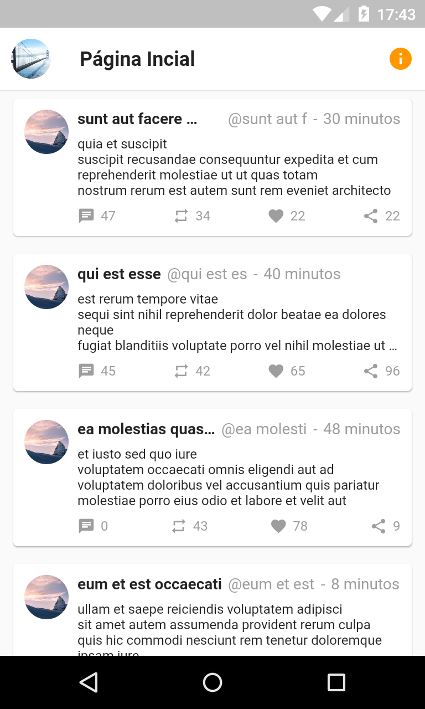
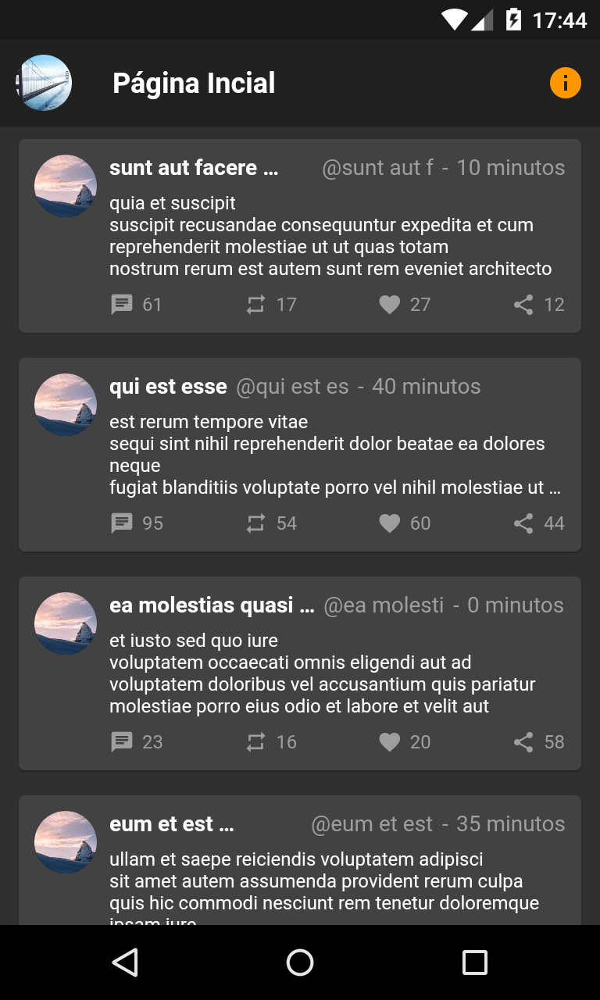

# QTwitter

Microblog inspirado no [Twitter](https://twitter.com/) para o minicurso de Flutter na UFC.

### Será abordado:

- Criação de aplicativos
- Design de interfaces
- Estruturação de pastas
- e consumo de APIs

|           Versão clara            |          Versão escura          |
| :-------------------------------: | :-----------------------------: |
|  |  |
|                                   |                                 |

### Referências:

- [Documentação do Flutter](https://flutter.dev/docs)
- [Documentação do Dart](https://dart.dev/guides)
- [JSON Placeholder](https://jsonplaceholder.typicode.com/)
- [Twitter Lite](https://play.google.com/store/apps/details?id=com.twitter.android.lite&hl=pt_BR)

Desenvolvido por [Robson Silva](https://www.linkedin.com/in/robsonsilv4/).
